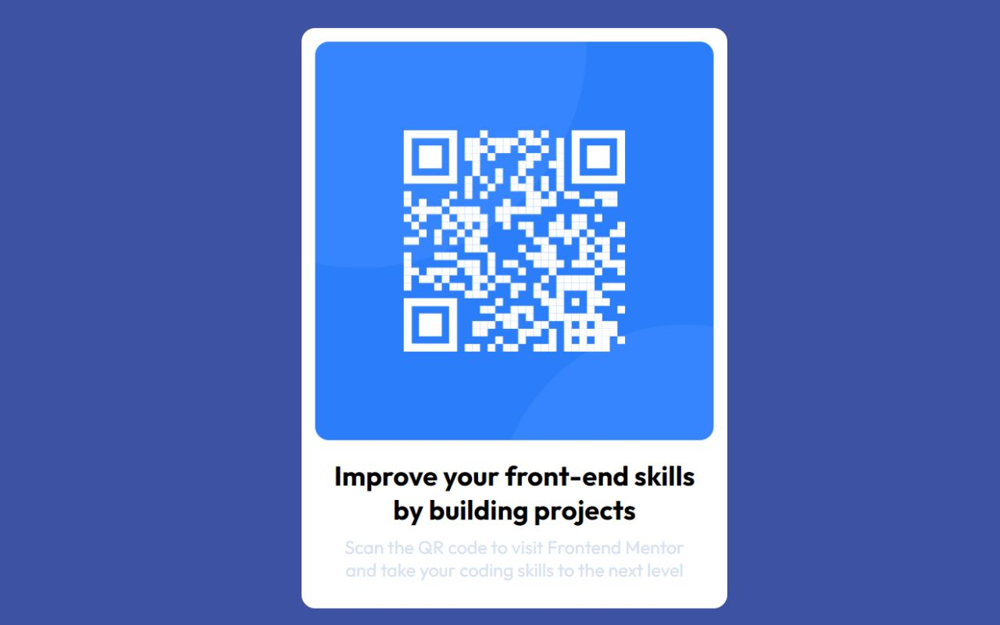

# Frontend Mentor - QR code component solution

This is a solution to the [QR code component challenge on Frontend Mentor](https://www.frontendmentor.io/challenges/qr-code-component-iux_sIO_H). Frontend Mentor challenges help you improve your coding skills by building realistic projects. 

## Table of contents

- [Overview](#overview)
  - [Screenshot](#screenshot)
  - [Links](#links)
- [My process](#my-process)
  - [Built with](#built-with)
  - [Continued development](#continued-development)
  - [Useful resources](#useful-resources)
- [Author](#author)

**Note: Delete this note and update the table of contents based on what sections you keep.**

## Overview

### Screenshot

### Links

- Solution URL: (https://github.com/Padmakar9394/QR-Card)
- Live Site URL: (https://padmakar9394.github.io/QR-Card/)

## My process

### Built with

- Semantic HTML5 markup
- CSS custom properties
- Flexbox

### Continued development

I'm currently studying javascript concepts, advanced css topics 

## Author

- Frontend Mentor - [Padmakar9394](https://www.frontendmentor.io/profile/Padmakar9394)
- LinkedIn - [padmakar gore](https://www.linkedin.com/in/padmakar-gore-3865b2216)

